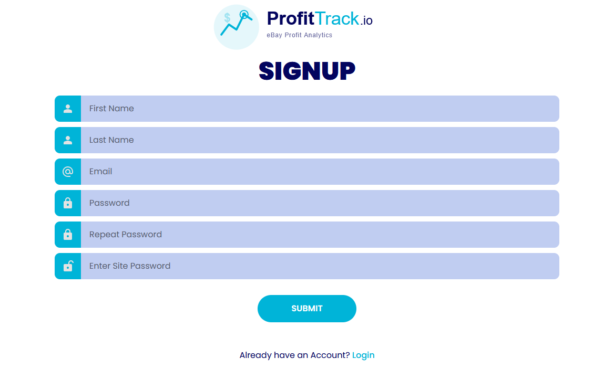
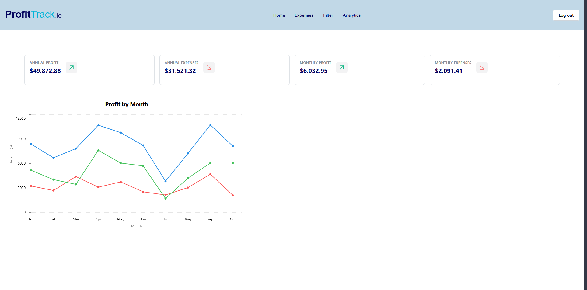
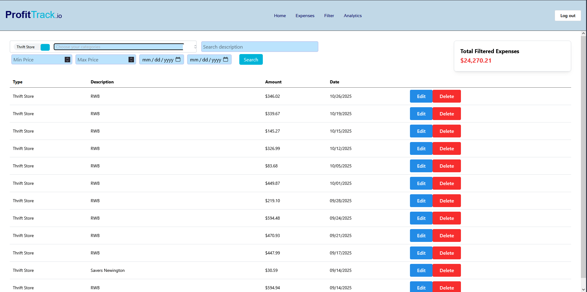
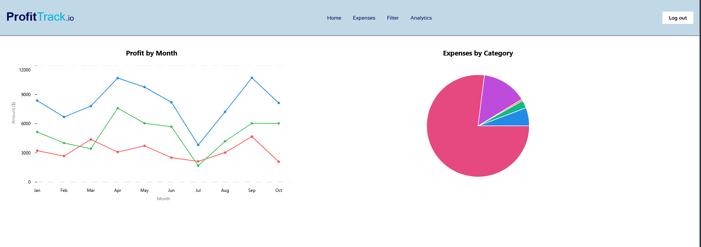

# ProfitTrack.io

> A web application that helps eBay resellers track profits by integrating with the eBay API to automatically pull payout data and calculate ROI based on user-inputted expenses.

## 🎯 Why I Built This

As an eBay reseller managing $200K in annual sales, I needed a way to automatically track my profits after tens of payouts and hundreds of expenses. Manually calculating profit margins was time-consuming and error-prone, so I built this tool to solve my own problem.

## ✨ Features

- **eBay API Integration**: Automatically fetches payout data
- **Multi-user Authentication**: Secure user accounts with Supabase Auth
- **Profit Calculations**: Calculates net profit based on sales and user-inputted expenses
- **Analytics Dashboard**: Visualizes monthly/annual profit trends as well as distribution of expenses across different categories
- **Expense Tracking**: Track costs like cost of goods, supplies, employees, etc.

## 🛠️ Tech Stack

**Frontend:**
- React 18
- React Router
- Mantine & Mantine Charts

**Backend:**
- Node.js
- Express
- Supabase Database
- Supabase Authentication

**Deployment:**
- Frontend & Backend: Render
- Database: Supabase

## 🏗️ Architecture
```
┌─────────────┐      ┌─────────────┐      ┌─────────────┐
│   React     │────▶│   Express   │────▶│   eBay API   │
│   Frontend  │      │   Backend   │      │             │
└─────────────┘      └─────────────┘      └─────────────┘
                            │
                            ▼
                     ┌─────────────┐
                     │   Supabase  │
                     │   Database  │
                     └─────────────┘
```

## 🚀 Getting Started

### Prerequisites
- Node.js 18+
- React
- eBay Developer Account (for API credentials)
- eBay account with valid payouts
- Supabase project (for authentication & databases)

### Installation

1. Clone the repository
```bash
git clone https://github.com/tomfiji/ProfitTrack.io
cd profit-tracker
```

2. Install dependencies
```bash
# Install all dependencies
npm install
```

3. Set up environment variables

Create a `.env` file in the backend directory:
```
SUPABASE_URL= your_supabase_project_url
SUPABASE_ANON_KEY= your_supabase_project_anon_key
SUPABASE_SERVICE_ROLE_KEY= your_supabase_project_role_key
VITE_SUPABASE_URL= your_supabase_project_url
VITE_SUPABASE_ANON_KEY= your_supabase_project_anon_key
VITE_SUPABASE_SERVICE_ROLE_KEY= your_supabase_project_role_key
EBAY_CLIENT_ID = ebay_developer_production_client_id
EBAY_CLIENT_SECRET= ebay_developer_production_client_secret
EBAY_RUNAME= ebay_developer_production_runame
EBAY_SCOPES=https://api.ebay.com/oauth/api_scope/sell.finances
VITE_SITE_PASSWORD= your_site_password_to_prevent_unwanted_users_from_signing_up
VITE_API_URL= your_localhost_url_to_run_server
VITE_APP_URL= your_localhost_url_to_run_frontend
FRONTEND_URL= your_localhost_url_to_run_frontend
```

4. Set up the database

Create the following tables in your Supabase project:

**ebay_connections table:**
```sql
CREATE TABLE ebay_connections (
  id UUID PRIMARY KEY DEFAULT gen_random_uuid(),
  user_id UUID REFERENCES auth.users(id),
  access_token TEXT,
  refresh_token TEXT,
  expires_at TIMESTAMPTZ,
  created_at TIMESTAMPTZ DEFAULT NOW(),
  updated_at TIMESTAMPTZ DEFAULT NOW()
);
```

**expenses table:**
```sql
CREATE TABLE expenses (
  id SERIAL PRIMARY KEY,
  user_id UUID REFERENCES auth.users(id),
  category TEXT,
  description TEXT,
  expense_date DATE,
  amount NUMERIC,
  created_at TIMESTAMPTZ DEFAULT NOW(),
  updated_at TIMESTAMPTZ DEFAULT NOW()
);
```

5. Run the application
```bash
# Terminal 1 - Backend
npm run server

# Terminal 2 - Frontend
npm run dev
```

Visit `http://localhost:5173` to see the app.


## 🎓 What I Learned

- **API Integration**: Working with eBay's API taught me how to handle OAuth flow
- **Multi-tenant Architecture**: Implemented user data isolation to ensure users only see their own data
- **State Management**: Managing complex async data flows between frontend and backend
- **Authentication**: Implementing secure auth with Supabase and protecting API routes
- **Database Design**: Designing a schema that efficiently handles  data

## 🐛 Known Issues / Future Improvements

- [ ] Add export to CSV functionality
- [ ] Faster refresh for monthly line chart
- [ ] Support for multiple marketplaces (Amazon, Mercari, etc.)
- [ ] Turn this into a mobile app


## 👤 Author

**Tom Fijalkowski**
- GitHub: [@TomFiji](https://github.com/tomfiji)
- LinkedIn: [Tom Fijalkowski](https://linkedin.com/in/tom-fijalkowski)
- Email: tf.tomfijalkowski@gmail.com

---

## 📸 Screenshots

### Sign Up / Login


### Dashboard


### Expense Filtering


### Analytics


## 🚀 Live Demo

[Live Demo](https://www.loom.com/share/a6ddaead8797495391cefdf39d67cfbe)


Built with ☕ and determination to land my first software engineering role!
```

---